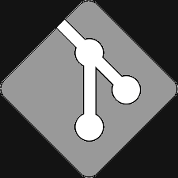

    
    

        
        
        
    

### hi, I'm Dave Daggett

#### contact me

<form action="https://formspree.io/david.g.daggett@gmail.com" method="POST" name="contact_form" target="_top" id="contact_form">
    <input class="formItem" type="text" name="_replyto" cols="35" id="email" value="" tabindex="4" placeholder="your email" />
    <textarea class="formItem" placeholder="hello, stanger ..." cols="35" rows="5" name="message" id="message"></textarea>
    <input class="formItem" type="submit" value="SEND" src="images/submit.png" border="0" alt="Submit Form" />
</form>
